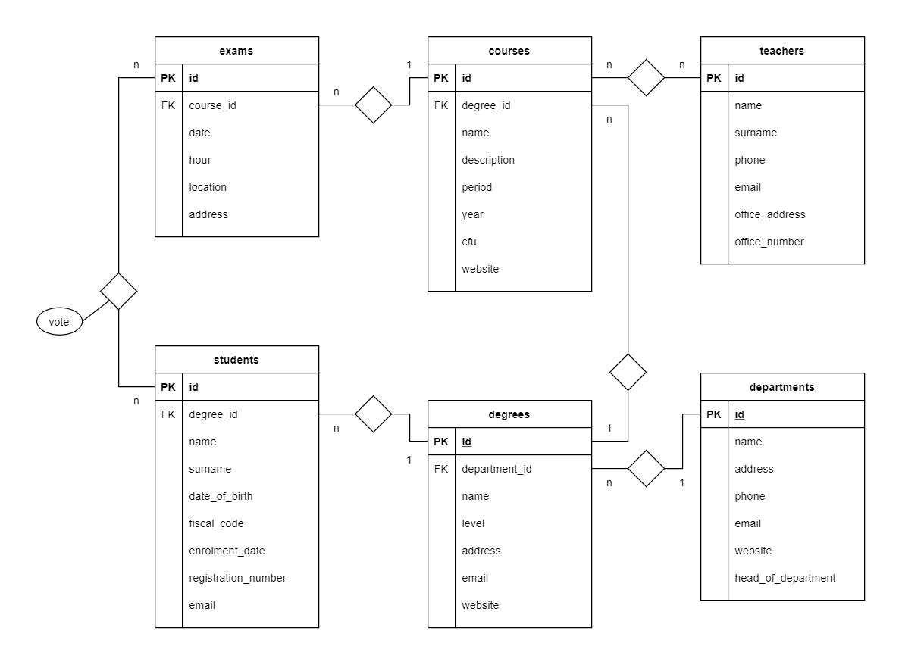

# db-university

## richiesta

Modellizzare la struttura di un database per memorizzare tutti i dati riguardanti una università:
sono presenti diversi **Dipartimenti** (es.: Lettere e Filosofia, Matematica, Ingegneria ecc.);
ogni Dipartimento offre più **Corsi di Laurea** (es.: Civiltà e Letterature Classiche, Informatica, Ingegneria Elettronica ecc..)
ogni Corso di Laurea prevede diversi **Corsi** (es.: Letteratura Latina, Sistemi Operativi 1, Analisi Matematica 2 ecc.);

ogni Corso può essere tenuto da diversi **Insegnanti**;
ogni Corso prevede più **appelli d’Esame**;
ogni **Studente** è iscritto ad un solo Corso di Laurea;

ogni Studente può iscriversi a più appelli di Esame;
per ogni appello d’Esame a cui lo Studente ha partecipato, è necessario memorizzare il voto ottenuto, anche se non sufficiente. 

## esercizio query 

### risposte 

1) SELECT * FROM `students` WHERE YEAR(date_of_birth) ='1990';
2) SELECT * FROM `courses` WHERE cfu > 10;
3) SELECT * FROM `students` WHERE YEAR(date_of_birth) > '1994';
4) SELECT * FROM `courses` WHERE period = 'I semestre' && year = 1;
5) SELECT * FROM `exams` WHERE date = '2020-06-20' && hour > '14:00:00';
6) SELECT * FROM `degrees` WHERE level = 'magistrale';
7) SELECT * FROM `departments` WHERE 1;
7) SELECT * FROM `teachers` WHERE phone;